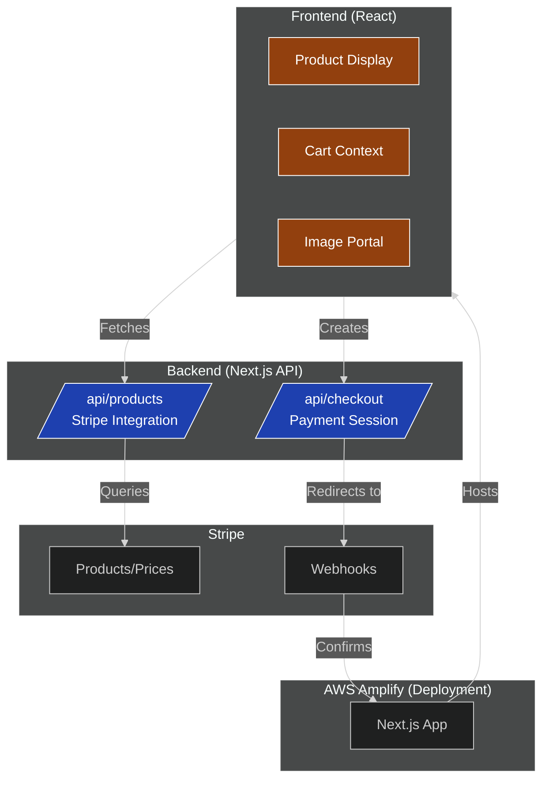

# ShipKit Store - Next.js E-Commerce with Stripe


👉 [Watch in higher quality on LinkedIn](https://www.linkedin.com/feed/update/urn:li:activity:7349652086994649088)


A modern e-commerce platform built with Next.js and Stripe Checkout, featuring cart management, product displays, and seamless payment processing.

## Table of Contents
- [Key Features](#key-features)
- [Tech Stack](#tech-stack)
- [Setup](#setup)
- [Deployment](#deployment)
- [Architecture Diagram](#Architecture-Diagram)
- [Troubleshooting](#troubleshooting)
- [Stripe Configuration](#stripe-configuration)

## Key Features
- **Stripe Integration**: 
  - Dynamic product loading from Stripe API
  - Pre-built Checkout with webhook verification
  - Real-time price calculations (in cents)
- **Cart Management**:
  - React Context + useReducer for state
  - Quantity adjustment with validation
- **Image Optimization**:
  - Progressive loading (low/high-res images)
  - Interactive portal for detailed viewing
- **Responsive Design**: Mobile-friendly layout with CSS modules

## Tech Stack
- **Frontend**: Next.js 14 (App Router), React 18
- **Backend**: Stripe API, Next.js API Routes
- **State Management**: React Context API
- **Deployment**: AWS Amplify
- **Styling**: CSS Modules

## Setup
1. Clone the repo:
   ```bash
   git clone https://github.com/KamoEllen/ShipKit-ecommerce-store.git
   cd ShipKit-ecommerce-store
   ```

2. Install dependencies:
   ```bash
   npm install
   ```

3. Create `.env.local` file:
   ```env
   NEXT_PUBLIC_BASE_URL=http://localhost:3000
   STRIPE_SECRET_KEY=your_stripe_secret_key
   ```

4. Run locally:
   ```bash
   npm run dev
   ```

## Deployment (AWS Amplify)
1. Connect your GitHub repo to Amplify
2. Set these build settings:
   ```yaml
   version: 1
   frontend:
     phases:
       preBuild:
         commands:
           - npm install
       build:
         commands:
           - npm run build
     artifacts:
       baseDirectory: .next
       files: ['**/*']
     cache:
       paths: ['node_modules/**/*']
   ```
3. Add environment variables in Amplify console


## Architecture Diagram

<!--


-->

## Troubleshooting
### 1. Images Not Loading
- **Issue**: Planner.png wasn't loading after Amplify deployment
- **Fix**: Ensure all image references match exact casing (Amplify is case-sensitive)
  ```jsx
  // Before (failed on Amplify)
  
  
  // After (works)
  
  ```

### 2. Stripe Products Not Loading Locally
- **Issue**: Products didn't appear during local development
- **Solution**:
  1. Verify Stripe API key has correct permissions
  2. Check active products in Stripe Dashboard
  3. Ensure price objects are attached to products
  4. Debug with:
     ```javascript
     console.log("Raw products:", products.data);
     console.log("Raw prices:", prices.data);
     ```

### 3. Webhook Verification
If payments succeed but order confirmation fails:
```bash
stripe listen --forward-to localhost:3000/api/webhooks
```

## Stripe Configuration
1. Create products in Stripe Dashboard
2. Ensure each product has:
   - Default price
   - Matching image names (case-sensitive)
3. Enable webhooks for:
   - `checkout.session.completed`
   - `payment_intent.succeeded`

## Folder Structure
```
/public
  /low_res       # Low-resolution images
  /med_res       # High-resolution images
/app
  /api           # Stripe API routes
  /cart          # Cart page
  /products      # Product listing
/components
  Cart.jsx       # Cart icon component
  Products.jsx   # Main product display
/context
  ProductContext.jsx # State management
```

## Known Limitations
- Cart persists only in memory (no database)
- No user authentication system
```
